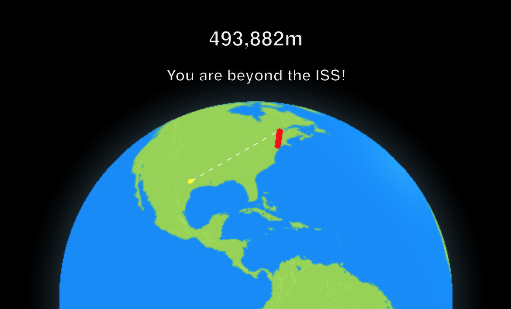

#  ICanSeeMyHouseFromHere!

A completely practical utility for calculating and visualizing the height required to achieve line of sight between two locations. [Try it online](https://chasedurand.github.io/ICanSeeMyHouseFromHere/)!

## ~~Limitations~~ Use Cases
 * You and your house are on perfectly spherical and terrain-free Earth.
 * Your infinite-vision eyeballs are 1.6m above your feet.
 * Your house is a single small point that is conveniently still observable.

## Acknowledgements
ThreeJS globe class from [vasturiano's three-globe](https://github.com/vasturiano/three-globe).

Public domain globe icon from [dannya](https://openclipart.org/detail/199629/primary-globe).

Geocoding done via [Nominatim](https://nominatim.org/).
